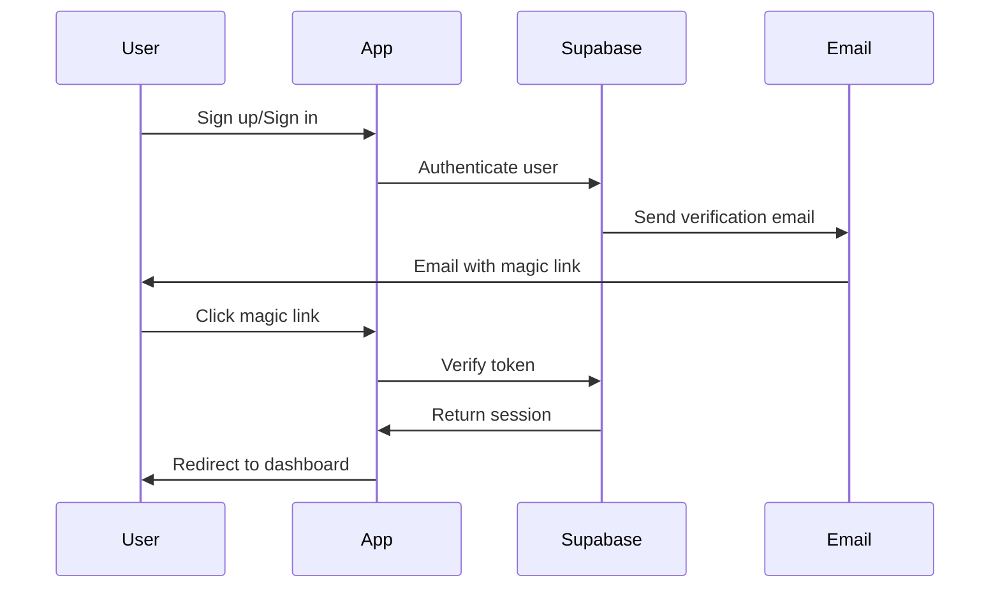
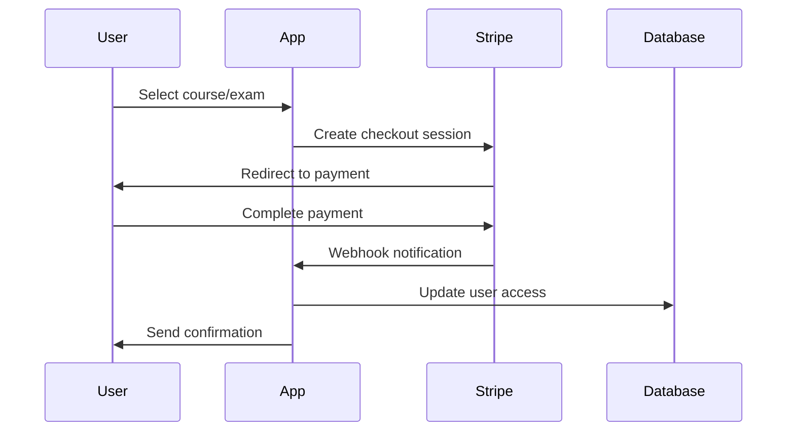

# 🎓 NSBS Platform

**National Society of Business Sciences Certification Platform**

A next-generation enterprise-grade professional certification platform
delivering immersive business education through rigorous courses, comprehensive
examinations, and verified digital credentials.


## 🌟 Overview

The NSBS Platform revolutionizes professional certification by combining
cutting-edge technology with rigorous academic standards. Built for modern
learners and organizations seeking validated business competencies.

### 🎯 Key Features

- **📚 Interactive Learning System** - Immersive course content with MDX-powered
  rich media
- **🔐 Secure Examinations** - Proctored testing environment with advanced
  anti-cheating measures
- **🏆 Digital Credentials** - Blockchain-verifiable certificates with PDF
  generation
- **💳 Payment Processing** - Integrated Stripe payments with subscription
  management
- **👤 User Management** - Role-based access control with Supabase
  authentication
- **📊 Analytics Dashboard** - Comprehensive learning analytics and progress
  tracking
- **🔒 Enterprise Security** - Row-level security, rate limiting, and audit
  trails

## 🚀 Technology Stack

### Core Framework

- **Next.js 15.5.0** - React framework with App Router
- **React 19.1.1** - Latest React with concurrent features
- **TypeScript 5.9.2** - Full type safety with strict configuration

### Styling & UI

- **TailwindCSS 4.1.12** - CSS-first configuration with custom NSBS brand
  palette
- **Radix UI** - Accessible component primitives
- **HeroUI** - Advanced UI component library
- **Motion** - Smooth animations and interactions (v12.23.12)
- **Lucide React** - Beautiful icon system

### Backend & Database

- **Supabase** - PostgreSQL database with real-time subscriptions
- **Enhanced RLS** - Row-level security policies for data protection
- **Stripe** - Payment processing and subscription management
- **Resend** - Transactional email service

### Development Tools

- **Jest** - Unit testing framework
- **Prettier** - Code formatting
- **ESLint** - Code linting
- **Zod** - Runtime type validation

## 🎨 NSBS Brand System

Our platform features a carefully crafted color palette that reflects
professionalism and warmth:

```css
/* NSBS Color Palette */
--mocha-mousse: #d4c7b8; /* Primary background - warm, inviting */
--evergreen: #20634a; /* Primary actions - professional, trustworthy */
--mint-sage: #8fb8a3; /* Accents - fresh, calming */
--sage: #9aab9a; /* Secondary elements - balanced, natural */
```

## 📁 Project Structure

```
nsbs0820/
├── app/                          # Next.js 15 App Router
│   ├── (admin)/                  # Admin dashboard routes
│   │   └── admin/
│   │       ├── certificates/     # Certificate management
│   │       ├── courses/          # Course administration
│   │       └── users/            # User management
│   ├── (auth)/                   # Authentication routes
│   │   └── auth/
│   │       ├── sign-in/          # Login functionality
│   │       └── sign-up/          # Registration
│   ├── (dashboard)/              # User dashboard
│   │   ├── account/              # Account management
│   │   ├── exam/                 # Examination system
│   │   └── learn/                # Learning interface
│   ├── api/                      # API routes
│   │   ├── certificates/         # Certificate generation
│   │   ├── checkout/             # Payment processing
│   │   ├── courses/              # Course management
│   │   ├── exams/                # Exam system
│   │   └── stripe/               # Stripe webhooks
│   ├── contact/                  # Contact forms
│   ├── coursecatalog/            # Course browsing
│   ├── policies/                 # Legal pages
│   └── verification/             # Certificate verification
├── components/                   # Reusable UI components
│   ├── auth/                     # Authentication components
│   ├── certificate/              # Certificate-related UI
│   ├── course/                   # Course interface components
│   ├── exam/                     # Examination interface
│   ├── payment/                  # Payment UI components
│   └── ui/                       # Base UI components (shadcn/ui)
├── lib/                          # Utility libraries
│   ├── auth.ts                   # Authentication helpers
│   ├── stripe.ts                 # Stripe integration
│   ├── supabase.ts               # Database client
│   ├── pdf-generator.ts          # Certificate generation
│   └── validation.ts             # Zod schemas
├── data/                         # Static data and course content
├── scripts/                      # Database scripts and migrations
├── memory-bank/                  # Project documentation
└── .github/sourceoftruth/        # Technical specifications
```

## 🚀 Quick Start

### Prerequisites

- **Node.js** 22.16.0+ (LTS recommended)
- **pnpm** (preferred package manager)
- **Supabase Account** for database
- **Stripe Account** for payments
- **Resend Account** for emails

### Installation

1. **Clone the repository**

   ```bash
   git clone https://github.com/AahPlexX/nsbs-platform.git
   cd nsbs-platform
   ```

2. **Install dependencies**

   ```bash
   pnpm install
   ```

3. **Environment setup**

   ```bash
   cp .env.example .env.local
   ```

   Configure your environment variables:

   ```env
   # Supabase
   NEXT_PUBLIC_SUPABASE_URL=your_supabase_url
   NEXT_PUBLIC_SUPABASE_ANON_KEY=your_supabase_anon_key
   SUPABASE_SERVICE_ROLE_KEY=your_service_role_key

   # Stripe
   NEXT_PUBLIC_STRIPE_PUBLISHABLE_KEY=your_stripe_publishable_key
   STRIPE_SECRET_KEY=your_stripe_secret_key
   STRIPE_WEBHOOK_SECRET=your_webhook_secret

   # Resend
   RESEND_API_KEY=your_resend_api_key
   ```

4. **Database setup**

   ```bash
   # Run database migrations
   pnpm run db:migrate

   # Seed initial data
   pnpm run db:seed
   ```

5. **Start development server**

   ```bash
   pnpm dev
   ```

   Open [http://localhost:3000](http://localhost:3000) to view the application.

## 🏗️ Development

### Available Scripts

```bash
pnpm dev          # Start development server
pnpm build        # Build for production
pnpm start        # Start production server
pnpm lint         # Run ESLint
pnpm test         # Run Jest tests
pnpm format       # Format code with Prettier
pnpm format:check # Check code formatting
```

### Database Management

```bash
# Create new migration
pnpm run db:migration:new

# Run migrations
pnpm run db:migrate

# Reset database
pnpm run db:reset

# Generate types
pnpm run db:types
```

### Testing

```bash
# Run all tests
pnpm test

# Run tests in watch mode
pnpm test:watch

# Run tests with coverage
pnpm test:coverage
```

## 🏛️ Architecture

### Authentication Flow



### Payment Processing



## 🔐 Security Features

- **Row-Level Security (RLS)** - Database-level access control
- **Rate Limiting** - API endpoint protection
- **Input Validation** - Zod schema validation
- **Authentication** - Supabase Auth with magic links
- **CSRF Protection** - Built-in Next.js protection
- **Environment Variables** - Secure configuration management

## 📊 Performance

- **ISR Caching** - Incremental Static Regeneration
- **Bundle Optimization** - Optimized build output
- **Image Optimization** - Next.js automatic optimization
- **Code Splitting** - Automatic route-based splitting
- **Edge Runtime** - Serverless function optimization

## 🌍 Deployment

### Vercel (Recommended)

1. **Connect repository**

   ```bash
   # Deploy to Vercel
   vercel --prod
   ```

2. **Configure environment variables** in Vercel dashboard

3. **Set up webhooks** for Stripe and Supabase

### Alternative Platforms

- **Netlify** - Static site deployment
- **Railway** - Full-stack deployment
- **DigitalOcean App Platform** - Container deployment

## 📖 Documentation

- **[API Documentation](./docs/api.md)** - REST API endpoints
- **[Database Schema](./docs/database.md)** - Database structure
- **[Component Library](./docs/components.md)** - UI component guide
- **[Deployment Guide](./docs/deployment.md)** - Production deployment
- **[Contributing Guide](./docs/contributing.md)** - Development guidelines

## 🤝 Contributing

We welcome contributions! Please read our
[Contributing Guide](./CONTRIBUTING.md) for details on our code of conduct and
the process for submitting pull requests.

### Development Workflow

1. **Fork the repository**
2. **Create a feature branch** (`git checkout -b feature/amazing-feature`)
3. **Make your changes** with proper tests
4. **Commit changes** (`git commit -m 'Add amazing feature'`)
5. **Push to branch** (`git push origin feature/amazing-feature`)
6. **Open a Pull Request**

## 📄 License

This project is proprietary software. All rights reserved by the National
Society of Business Sciences.

## 🆘 Support

- **Documentation**: [docs.nsbs.edu](https://docs.nsbs.edu)
- **Email Support**: support@nsbs.edu
- **Issue Tracker**:
  [GitHub Issues](https://github.com/AahPlexX/nsbs-platform/issues)
- **Community Forum**: [community.nsbs.edu](https://community.nsbs.edu)

## 👥 Team

**Lead Developer**: AahPlexX  
**Organization**: National Society of Business Sciences  
**Repository**: [github.com/AahPlexX/nsbs-platform](https://github.com/AahPlexX/nsbs-platform)

---

<div align="center">
  <strong>🎓 Elevating Business Education Through Technology 🚀</strong>
  <br>
  <em>National Society of Business Sciences • 2025</em>
</div>
