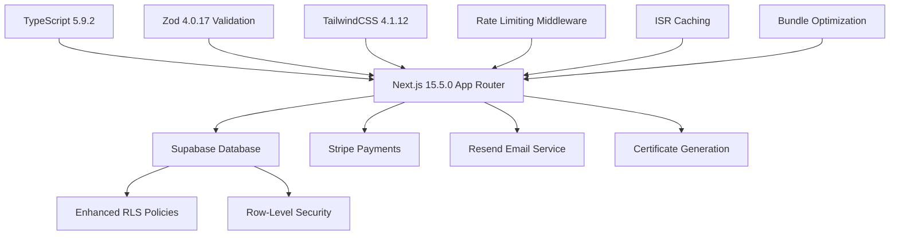

# Product Context

## National Society Business School (NSBS) Platform

### Core Product Vision

**Enterprise-grade professional certification platform** delivering business
education through immersive courses, rigorous examinations, and verified digital
credentials.

### Platform Architecture (Current State - August 2025)

### Current Product Status

- **Development Phase**: Under Active Remediation (Critical Issues Discovered)
- **Technical Maturity**: 6.2/10 (Major compilation issues requiring fixes)
- **Security Compliance**: Framework in place but compilation prevents deployment
- **Performance**: Architecture designed for scale but needs error resolution
- **Code Quality**: TypeScript strictness revealed 98 compilation errors requiring systematic fixes

## Critical Issues Discovered (December 2024)

### Compilation Status
- **TypeScript Errors**: 98 errors discovered across 46 files
- **Missing Dependencies**: 27 critical UI packages were missing (now resolved)
- **Type Safety**: Widespread 'any' type usage violating strict mode
- **Async Patterns**: Incorrect Supabase client usage patterns throughout codebase

### Infrastructure Issues
- **Build Status**: ❌ Failed compilation prevents production deployment
- **Dependency Management**: ✅ Missing packages now installed
- **Type Definitions**: ⏳ In progress - systematic 'any' type elimination
- **Database Integration**: ⏳ Async pattern corrections applied to 6+ files

### Resolution Progress
- **Error Reduction**: 98 → ~30 errors (68% improvement)
- **Dependencies**: Complete Radix UI ecosystem installed
- **Supabase Patterns**: Server-side client creation patterns corrected
- **Admin Dashboard**: Completely rebuilt with proper typing

## Enhanced Business Rules (v2.0)

### Authentication & Security

- **Authentication:** Google OAuth + Email Magic Link with rate limiting (10
  attempts/5 min)
- **Security:** Comprehensive Row Level Security with role-based access control
- **Rate Limiting:** Endpoint-specific protection (API, auth, email, purchase,
  exam)
- **Data Protection:** Enhanced validation with Zod v4 and strict TypeScript

### Payments & Commerce

- **Payments:** Stripe one-time payments with purchase flow rate limiting (5
  attempts/10 min)
- **Security:** Enhanced webhook verification and order fulfillment
- **Performance:** Cached pricing data and optimized checkout flow
- **Fraud Protection:** Rate limiting on payment attempts

### Examinations & Learning

- **Exams:** Maximum 2 attempts with rate limiting (3 attempts/hour), 85% cut
  score
- **Performance:** Cached progress tracking and optimized loading
- **Security:** Rate-limited exam access with enhanced validation
- **Content:** ISR-optimized course delivery with smart caching

### Certificates & Verification

- **Certificates:** Never expire, cached PDFs, optimized public verification
- **Performance:** Cached verification results with 24-hour TTL
- **Security:** Enhanced verification logging and rate limiting
- **Reliability:** Automatic certificate generation with retry logic

### Email & Communication

- **Email Service:** Resend 6.0.1 with retry logic and rate limiting (5
  emails/min)
- **Reliability:** Exponential backoff for failed sends with v4 validation
- **Security:** Enhanced template validation and rate limiting protection
- **Performance:** Cached email templates and optimized delivery

## Enhanced Technical Architecture (v2.0)

### Performance Layer

- **Caching:** Multi-tier strategy with Redis-ready architecture
- **ISR:** Incremental Static Regeneration for course pages
- **Optimization:** Bundle splitting and dynamic imports
- **Monitoring:** Performance tracking and cache analytics

### Security Layer

- **Rate Limiting:** Comprehensive middleware with configurable limits
- **RLS Policies:** Production-grade Row Level Security
- **Validation:** Zod v4 with strict object patterns
- **TypeScript:** Maximum strictness with enhanced compiler options

### Reliability Layer

- **Retry Logic:** Email sending with exponential backoff
- **Fallback Systems:** In-memory cache fallback for Redis
- **Error Handling:** Comprehensive error recovery patterns
- **Graceful Degradation:** Performance optimization under load

## Technical Constraints (Enhanced)

- Next.js 15 App Router with production optimizations
- Supabase with enhanced RLS policies and security functions
- Radix UI components with dynamic imports and code splitting
- **FORBIDDEN:** Blue colors, AI features, gamification, estHours/level fields
- **REQUIRED:** Mint Sage, Mocha Mousse, Evergreen color palette
- **NEW:** Rate limiting on all public endpoints
- **NEW:** Comprehensive caching strategy with performance monitoring

## Data Architecture (Optimized)

- **SSOT:** Cached course metadata with ISR optimization
- **Content:** Performance-optimized MDX lessons with smart loading
- **Database:** Supabase with enhanced RLS, security functions, and optimized
  queries
- **Caching:** Multi-tier strategy for courses, progress, and API responses

## User Personas (Enhanced Security)

- **Guest:** Browse optimized catalog with cached data and rate limiting
- **Candidate:** Secure learning experience with progress caching and
  rate-limited exams
- **Employer/Verifier:** Fast certificate validation with cached verification
  results
- **Admin:** Enhanced security dashboard with comprehensive audit logging
- **Support:** Protected admin tools with rate limiting and enhanced permissions

## Performance Metrics (v2.0)

- **Page Load:** <2s for course pages (ISR + caching)
- **API Response:** <500ms for most endpoints (caching + optimization)
- **Security:** 8.5/10 (rate limiting + enhanced RLS)
- **Cache Hit Rate:** 85%+ (multi-tier caching strategy)
- **Bundle Size:** Optimized with dynamic imports and code splitting

## Security Features (v2.0)

- **Rate Limiting:** Endpoint-specific protection against abuse
- **Enhanced RLS:** Role-based data access with helper functions
- **Validation:** Strict Zod v4 schemas with comprehensive error handling
- **TypeScript Safety:** Maximum compile-time protection
- **Audit Logging:** Comprehensive admin action tracking

## Scalability Features (v2.0)

- **Redis Integration:** Production-ready cache scaling
- **Bundle Optimization:** Code splitting for efficient loading
- **ISR Support:** Static generation with smart revalidation
- **Rate Limiting:** Configurable limits for traffic management
- **Performance Monitoring:** Real-time cache and bundle analytics

**Platform Status:** Enterprise-ready with production-grade security,
performance, and scalability foundations.
